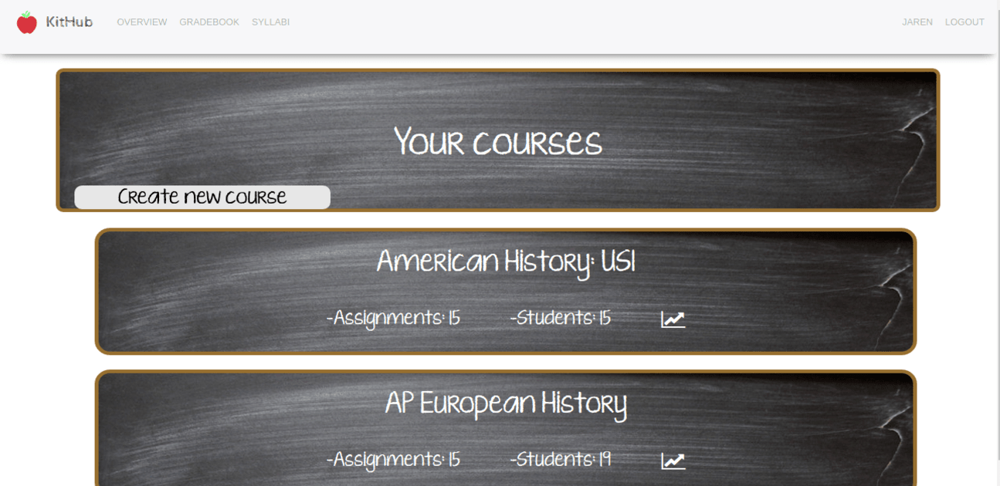
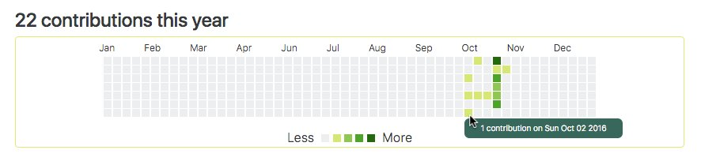
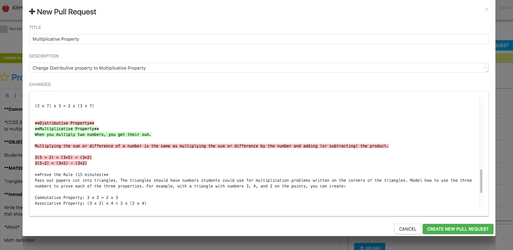
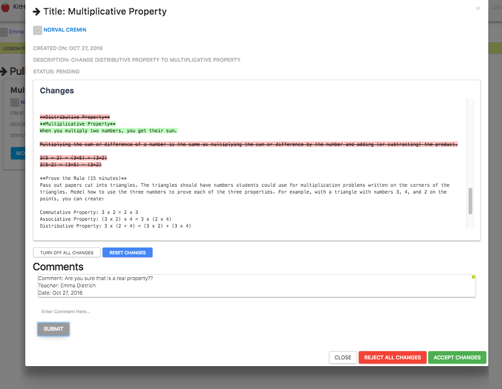
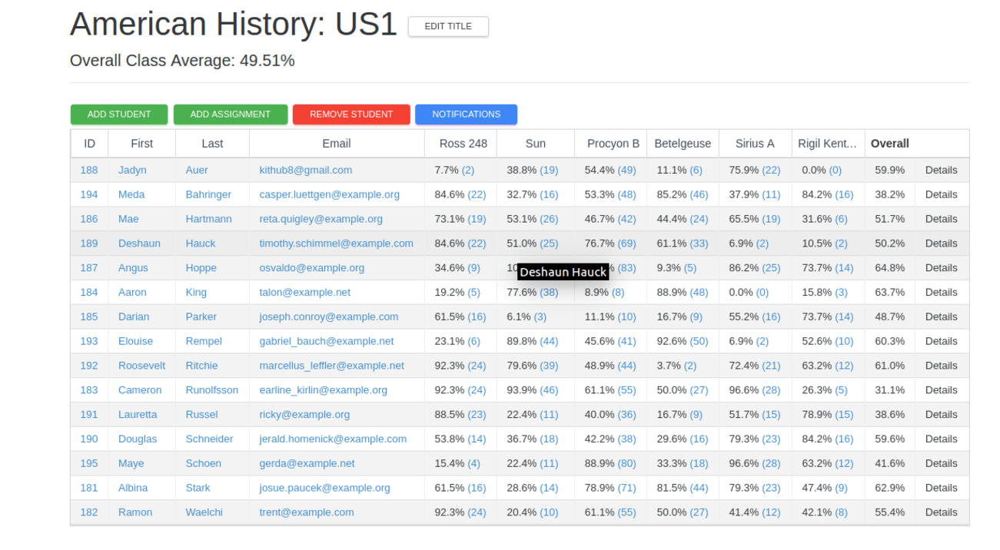

# Welcome to KitHub

KitHub is designed for teachers. It is a platform for sharing and colloborating on lesson plans, an online gradebook that includes tools not just for tracking student scores, but also visualizing class data and applying grading curves, and finally a scheduling tool for assigning lessons to different class periods. It consists of three separate AngularJS apps backed by a Ruby on Rails API.

## Lesson plans

Each user can post any number of lesson plans, formatted in Markdown. A user can create a new blank plan, or, if preferred, upload a Word document that will be converted.

On the lesson plan page, users may click 'Edit' to alter the contents of the plan, change attributes, and upload additional materials associated with the project. Clicking the 'Save' button commits the changes. On the settings page, a user may delete the lesson or download a copy as a Word document.

Users may also find the lesson plans of others users and fork them. After making edits, these changes may submitted to the original lesson owner, who can then accept or reject the changes. (These contributions are noted on a user's home page.) When the original lesson changes, teachers who have forked that lesson will be prompted to accept or reject the changes in their own copy.

## Gradebook

The gradebook displays a list of courses for the teacher. Hovering the mouse over a course displays a graph of the average grade for each assignment. A teacher can add new courses by clicking the "Create new course" button.

Clicking a summary shows the course's page. A user can click the title of the course to see graphs for data about the course. A teacher may also add students and assignments to the course. Once an assignment is added, clicking its name at the top of the column will bring up data about that assignment and allow a curve to be applied.

The 'Notifications' button allows the teacher to send out emails to students who have a particularly high or low average.

## Syllabi

This page has a list of the courses added in the gradebook. The 'Edit Course Days' button allows a teacher to set the start and end dates for the course and the days of the week the class will meet. Once dates are set, the 'Add Lesson Plans' button brings up a calendar page. Here, lesson plans you have added may be dragged onto a calendar day to assign the lesson to that particular date.

## Technical Highlights

### Converting A Word Document

Uploading on the front end is done using the Angular Upload library. Once a file is verified as the correct MIME type, it is sent in a request to the Rails API, which uses the uploaded temporary file and Pandoc, a command line interface conversion library uploaded to Heroku as a buildpack, to produce a Markdown version of the file. This version is saved as the contents of the new lesson plan. Finally, a lesson plan JavaScript object is returned to the front end Angular app.

### Uploading and downloading additional materials

Kithub uses the ng-file-upload directive to upload profile photos, lesson plans and additional materials. Photos and additional materials are attached to Rails models using the paperclip gem and stored in AWS. When a user downloads a lesson, the lesson plan markdown file is converted to word, saved as a tempfile and then sent from Rails to the browser for downloading.

### Contributions Calendar

The contributions calendar uses three custom directives to form the grid. A contributions service populates an index table on the front-end and serves that data to each square in the calendar. For each user, the service calculates the maximum daily contribution value and uses that to construct a color scale that starts at dark green and gets lighter for each quartile, down to gray for 0 contributions.

### Pull Requests

With Kithub, teachers can collaborate with each other on their lesson plans by submitting Github-style "pull requests" to other teacher's lesson plans. By integrating the JS Diff library, we display deletions and additions to both the pull requestor and the pull requestee. The original lesson plan owner then has the option to accept or reject changes to their master copy of the lesson plan. The owner can accept or reject all changes or pick and chose specific portions to accept. Once a user has accepted a pull request to their copy of the lesson plan, those changes are immediatley be reflected in their lesson. Collaborating on lesson plans has never been easier!

### Create Syllabi
The syllabi feature allows users to add lesson plans to their courses. The feature allows users to set start dates, end dates, and meeting days for their courses, which then creates a list of days that the course meets. The feature then uses the angular drag-drop library to let the user move lesson plans to a day their course meets. Upon dropping a lesson plan on a scheduled day, the updates are saved on the front-end and an AJAX call is made through Restangular to save the addition on the server.

###Gradebook Updates
Bringing the tradional gradebook into the 21st century, teachers can update their gradebook in nearly anytime way, which sends an AJAX request to our API, and changes are instantly reflected accordingly. Teachers may also notify students via email about individual assignments and overall score of the class, as well as whether they are failing(under 60%) or doing expetional well(over 90%). The emails are sent using Restangular post requests to Rails. Utliziing Rail's ActionMailer with the help of SendGrid delivers emails instantly.

## Authors

* [Alex](https://github.com/alexglach)
* [David](https://github.com/davidmjiang)
* [Dylan](https://github.com/lynchd2)
* [Graham](https://github.com/tgturner)
* [Hannah](https://github.com/hannahsquier)
* [Leo](https://github.com/leosaysger)
* [Matt](https://github.com/mnd-dsgn)
* [Mike](https://github.com/asackofwheat)
* [Phil](https://github.com/philipcolejohnson)

